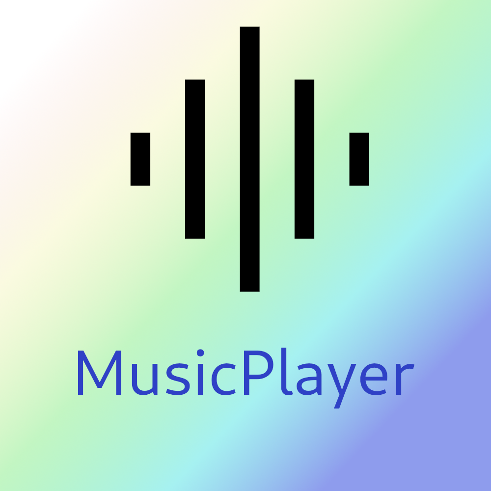

    
    <h1>MusicPlayerV2</h1>

    
    
    
    
    
    
     
    
    
    
    
     
    
    
    
    

A music player, specifically created for displaying song information from a CSV or JSON file on multiple different displays that are connected
to the same network, just from the browser. 

# Features
- Electron App that runs on all major Desktop OS (Linux, MacOS & Windows)
- Show all song information over the local network on any amount of client displays
- Client displays show the playback position and all information from the CSV / JSON file that contains all song information
- Modular themes (set a precreated theme in the settings page or add your own)
- Play most common music files
